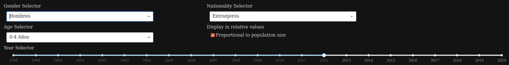

# Population growth in Spain

App made with [Dash](https://dash.plotly.com/) to learn how to do interactive plots to display information. The plot I decided to make was the map of population of Spain divided by communities. The data is obtained from the [INE](https://www.ine.es/index.htm), from ['Estadística del Padrón continuo']("https://www.ine.es/dyngs/INEbase/es/operacion.htm?c=Estadistica_C&cid=1254736177012&menu=ultiDatos&idp=1254734710990#).

 
 
### How to use the map

On top of the map there are some options: `Gender Selector`, `Age Selector`, `Nationality Selector`, `Display in relative values` and `Year Selector`.

Each one allows to update the map with the proper selections. For example, if we want to see the population of foreigner boys between 0 and 4 years in Spain in the year 2012, and we want to see the colors in proportion of the community population, then we would select:

In the map, the communities can be selected to display a detailed information per community in the bottom right plot. TO stop seeing the information from that community, you can click again in it.

 
 

### Additional information

The code is available at [this repository]() and the deployed app is in [this webpage]().
